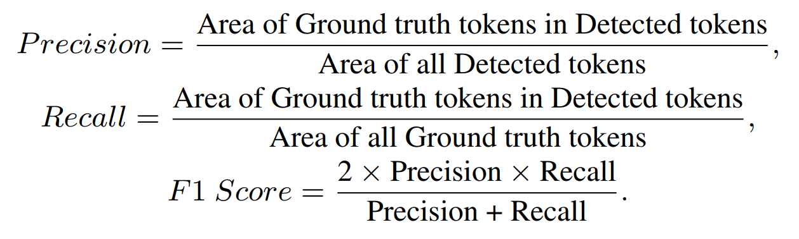

# DocBank

**\*\*\*\*\* DocBank is a natural extension of the TableBank ([repo](https://github.com/doc-analysis/TableBank), [paper](https://arxiv.org/abs/1903.01949)) dataset \*\*\*\*\***

**\*\*\*\*\* LayoutLM ([repo](https://github.com/microsoft/unilm/tree/master/layoutlm), [paper](https://arxiv.org/abs/1912.13318)) is an effective pre-training method of text and layout and archives the SOTA result on DocBank \*\*\*\*\***


DocBank is a new large-scale dataset that is constructed using a weak supervision approach. It enables models to integrate both the textual and layout information for downstream tasks. The current DocBank dataset totally includes 500K document pages, where 400K for training, 50K for validation and 50K for testing.


## Introduction

For document layout analysis tasks, there have been some image-based document layout datasets, while most of them are built for computer vision approaches and they are difficult to apply to NLP methods. In addition, image-based datasets mainly include the page images and the bounding boxes of large semantic structures, which are not fine-grained token-level annotations. Moreover, it is also time-consuming and labor-intensive to produce human-labeled and fine-grained token-level text block arrangement. Therefore, it is vital to leverage weak supervision to obtain fine-grained labeled documents with minimum efforts, meanwhile making the data be easily applied to any NLP and computer vision approaches. 

To this end, we build the DocBank dataset, a  document-level  benchmark with fine-grained token-level annotations for layout  analysis. Distinct from the conventional human-labeled datasets, our approach obtains high quality annotations in a simple yet effective way with weak supervision.

## Statistics of DocBank
The DocBank dataset consists of 500K document pages with 12 types of semantic units.

### Semantic Structure Statistics of DocBank
| Split | Abstract | Author | Caption |  Date | Equation | Figure | Footer |  List  | Paragraph | Reference | Section | Table | Title |  Total  |
|:-----:|:--------:|:------:|:-------:|:-----:|:--------:|:------:|:------:|:------:|:---------:|:---------:|:-------:|:-----:|:-----:|:-------:|
| Train |   25,387  |  25,909 |  106,723 |  6,391 |  161,140  |  90,429 |  38,482 |  44,927 |   398,086  |   44,813   |  180,774 | 19,638 | 21,688 |  400,000 |
|       |   6.35%  |  6.48% |  26.68% | 1.60% |  40.29%  | 22.61% |  9.62% | 11.23% |   99.52%  |   11.20%  |  45.19% | 4.91% | 5.42% | 100.00% |
|  Dev  |   3,164   |  3,286  |  13,443  |  797  |   20,154  |  11,463 |  4,804  |  5,609  |   49,759   |    5,549   |  22,666  |  2,374 |  2,708 |  50,000  |
|       |   6.33%  |  6.57% |  26.89% | 1.59% |  40.31%  | 22.93% |  9.61% | 11.22% |   99.52%  |   11.10%  |  45.33% | 4.75% | 5.42% | 100.00% |
|  Test |   3,176   |  3,277  |  13,476  |  832  |   20,244  |  11,378 |  4,876  |  5,553  |   49,762   |    5,641   |  22,384  |  2,505 |  2,729 |  50,000  |
|       |   6.35%  |  6.55% |  26.95% | 1.66% |  40.49%  | 22.76% |  9.75% | 11.11% |   99.52%  |   11.28%  |  44.77% | 5.01% | 5.46% | 100.00% |
| Total |   31,727  |  32,472 |  133,642 |  8,020 |  201,538  | 113,270 |  48,162 |  56,089 |   497,607  |   56,003   |  225,824 | 24,517 | 27,125 |  500,000 |
|       |   6.35%  |  6.49% |  26.73% | 1.60% |  40.31%  | 22.65% |  9.63% | 11.22% |   99.52%  |   11.20%  |  45.16% | 4.90% | 5.43% | 100.00% |

### Year Statistics of DocBank

|  Year |  Train |         |  Dev  |         |  Test |         |   ALL  |         |
|:-----:|:------:|:-------:|:-----:|:-------:|:-----:|:-------:|:------:|:-------:|
|  2014 |  65,976 |  16.49% |  8,270 |  16.54% |  8,112 |  16.22% |  82,358 |  16.47% |
|  2015 |  77,879 |  19.47% |  9,617 |  19.23% |  9,700 |  19.40% |  97,196 |  19.44% |
|  2016 |  87,006 |  21.75% | 10,970 |  21.94% | 10,990 |  21.98% | 108,966 |  21.79% |
|  2017 |  91,583 |  22.90% | 11,623 |  23.25% | 11,464 |  22.93% | 114,670 |  22.93% |
|  2018 |  77,556 |  19.39% |  9,520 |  19.04% |  9,734 |  19.47% |  96,810 |  19.36% |
| Total | 400,000 | 100.00% | 50,000 | 100.00% | 50,000 | 100.00% | 500,000 | 100.00% |

### Comparison of DocBank with existing document layout analysis datasets
|     Dataset     |  #Pages | #Units | Image-based? | Text-based? | Fine-grained? | Extendable? |
|:---------------:|:-------:|:------:|:------------:|:-----------:|:-------------:|:-----------:|
| Article Regions |   100   |    9   |       ✔      |      ✘      |       ✔       |      ✘      |
|     GROTOAP2    | 119,334 |   22   |       ✔      |      ✘      |       ✘       |      ✘      |
|    PubLayNet    | 364,232 |    5   |       ✔      |      ✘      |       ✔       |      ✘      |
|    TableBank    | 417,234 |    1   |       ✔      |      ✘      |       ✔       |      ✔      |
|     DocBank     | 500,000 |   12   |       ✔      |      ✔      |       ✔       |      ✔      |

## Baseline
As the dataset was fully annotated at token-level, we consider the document layout analysis task as a text-based sequence labeling task. 

Under this setting, we evaluate three representative pre-trained language models on our dataset including BERT, RoBERTa and LayoutLM to validate the effectiveness of DocBank.

### Metrics
As the inputs of our model are serialized 2-D documents, the typical BIO-tagging evaluation is not suitable for our task. The tokens of each semantic unit may discontinuously distribute in the input sequence.

In this case, we proposed a new metric, especially for text-based document layout analysis methods. For each kind of document semantic structure, we calculated their metrics individually. The definition is as follows:



### Settings
Our baselines of BERT and RoBERTa are built upon the HuggingFace's Transformers while the LayoutLM baselines are implemented with the codebase in [LayoutLM's official repository](https://aka.ms/layoutlm). We used 8 V100 GPUs with a batch size of 10 per GPU. It takes 5 hours to fine-tune 1 epoch on the 400K document pages. We used the BERT and RoBERTa tokenizers to tokenize the training samples and optimized the model with AdamW. The initial learning rate of the optimizer is 5*10^{-5}. We split the data into a max block size of N=512.

### Results

#### The evaluation results of BERT, RoBERTa and LayoutLM
|      Unit     | bert-base | roberta-base | layoutlm-base | bert-large | roberta-large | layoutlm-large |
|:-------------:|:---------:|:------------:|:-------------:|:----------:|:-------------:|:--------------:|
|    Abstract   |  0.9294   |    0.9288    |    **0.9816**     |   0.9286   |    0.9479     |     0.9784     |
|     Author    |  0.8484   |    0.8618    |    0.8595     |   0.8577   |    0.8724     |     **0.8783**     |
|    Caption    |  0.8629   |    0.8944    |    **0.9597**     |   0.8650   |    0.9081     |     0.9556     |
|    Equation   |  0.8152   |    0.8248    |    0.8947     |   0.8177   |    0.8370     |     **0.8974**     |
|     Figure    |  1.0000   |    1.0000    |    1.0000     |   1.0000   |    1.0000     |     **1.0000**     |
|     Footer    |  0.7805   |    0.8014    |    0.8957     |   0.7814   |    0.8392     |     **0.9146**     |
|      List     |  0.7133   |    0.7353    |    0.8948     |   0.6960   |    0.7451     |     **0.9004**     |
|   Paragraph   |  0.9619   |    0.9646    |    0.9788     |   0.9619   |    0.9665     |     **0.9790**     |
|   Reference   |  0.9310   |    **0.9341**    |    0.9338     |   0.9284   |    0.9334     |     0.9332     |
|    Section    |  0.9081   |    0.9337    |    **0.9598**     |   0.9065   |    0.9407     |     0.9596     |
|     Table     |  0.8296   |    0.8389    |    0.8633     |   0.8320   |    0.8494     |     **0.8679**     |
|     Title     |  0.9442   |    0.9511    |    **0.9579**     |   0.9430   |    0.9461     |     0.9552     |
| Macro average |  0.8705   |    0.8793    |    0.9214     |   0.8707   |    0.8933     |     **0.9243**     |


We evaluate six models on the test set of DocBank. We notice that the LayoutLM gets the highest scores on the \{abstract, author, caption, equation, figure, footer, list, paragraph, section, table, title\} labels. The RoBERTa model gets the best performance on the "reference" label but the gap with the LayoutLM is very small. This indicates that the LayoutLM architecture is significantly better than the BERT and RoBERTa architecture in the document layout analysis task. 
## License
DocBank is released under the [Attribution-NonCommercial-NoDerivs License](https://creativecommons.org/licenses/by-nc-nd/4.0/). You must give appropriate credit, provide a link to the license, and indicate if changes were made. You may not use the material for commercial purposes. If you remix, transform, or build upon the material, you may not distribute the modified material.

## Model Zoo

The trained models available for download in the [DocBank Model Zoo](MODEL_ZOO.md).

## Get Data

**We provide [100 samples](DocBank_samples/README.md) as a preview.**

Please fill this [form](https://forms.office.com/Pages/ResponsePage.aspx?id=v4j5cvGGr0GRqy180BHbRw1hSTX2waZIoerSk1J6CyNUQjA3QlBVUDYxMTY4NFpVR1UxNVRRU0ZIUS4u). If the review is approved, the download link will be sent to your email address. 

The link will be reviewed and sent **the next Monday after the application**


## Paper and Citation
### DocBank: A Benchmark Dataset for Document Layout Analysis

Minghao Li, Yiheng Xu, Lei Cui, Shaohan Huang, Furu Wei, Zhoujun Li, Ming Zhou

https://arxiv.org/abs/2006.01038
```
@misc{li2020docbank,
    title={DocBank: A Benchmark Dataset for Document Layout Analysis},
    author={Minghao Li and Yiheng Xu and Lei Cui and Shaohan Huang and Furu Wei and Zhoujun Li and Ming Zhou},
    year={2020},
    eprint={2006.01038},
    archivePrefix={arXiv},
    primaryClass={cs.CL}
}
```
